# Canvasia 📷✨

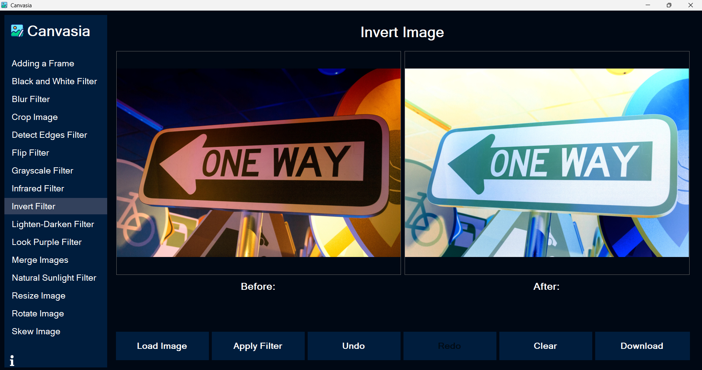

## Overview:
This application is a C# .NET Windows Forms application that allows users to load photos, apply various image filters, and save the edited photos easily.

## Image Filters 🎨

Purple 💜

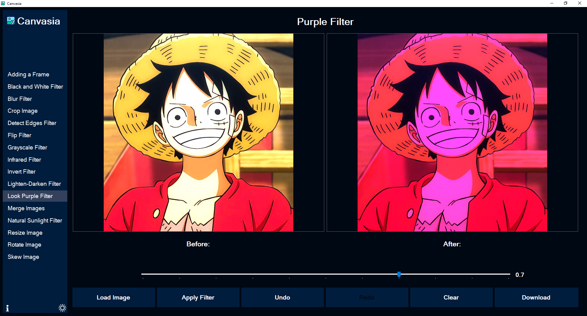

- Applies a purple tint to the image, enhancing cool tones while preserving highlights and shadows.

Infrared 🔴

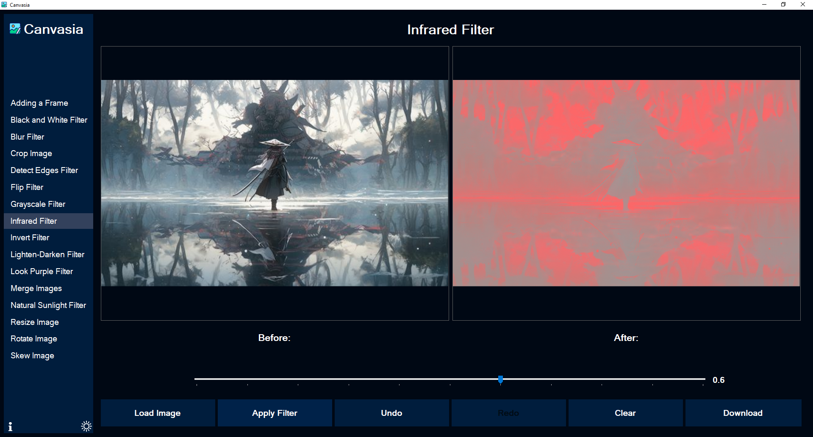

- Simulates infrared photography by emphasizing red tones and creating an ethereal, surreal effect.

Sunlight ☀️

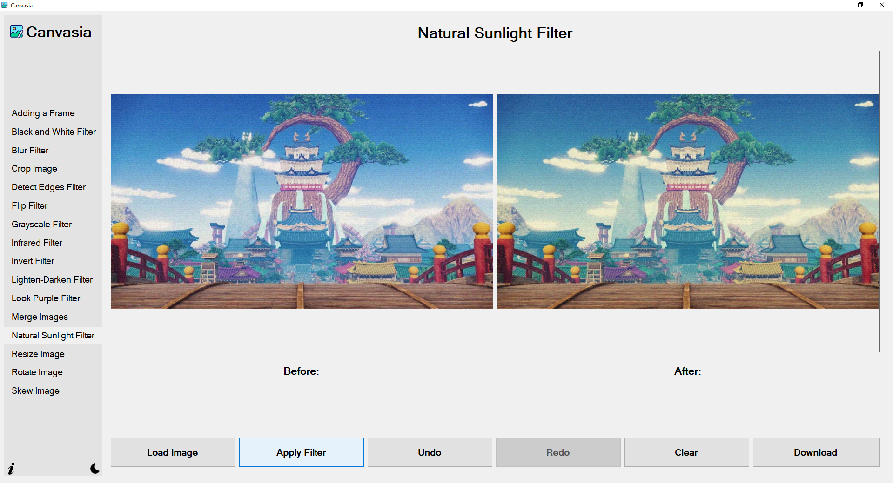

- Adds warm golden tones to mimic natural sunlight, creating a bright and cheerful atmosphere.

Invert 🔄

- Creates a negative effect by reversing all colors in the image (white becomes black, etc.).

Rotate 🔄

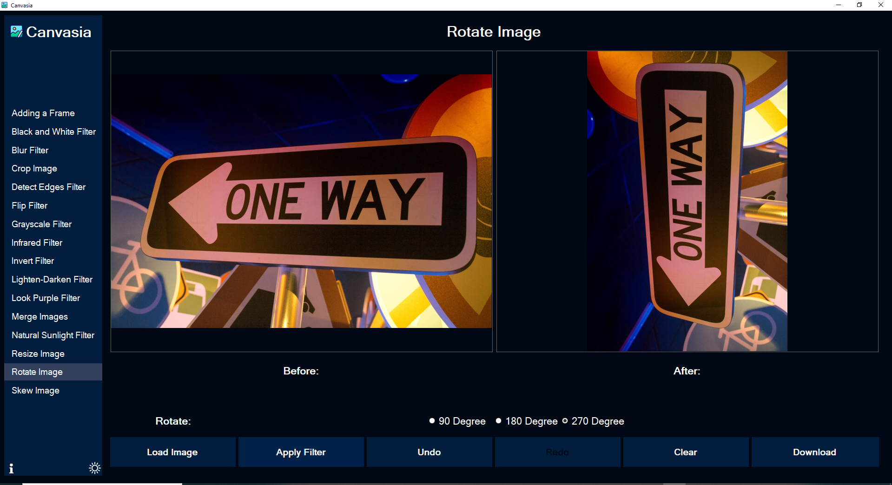

- Allows 90° clockwise/counter-clockwise rotations and free rotation with angle adjustment.

Blur 🌫️

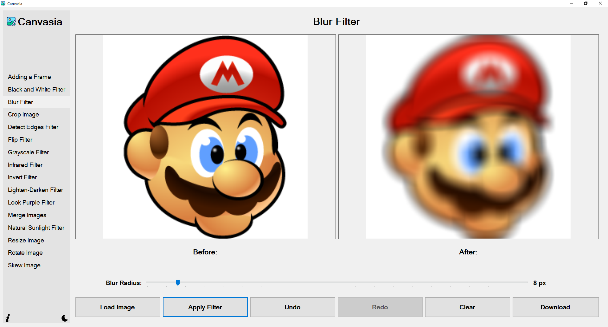

- Softens image details with adjustable intensity (Gaussian blur implementation).

Edge Detection ⚡

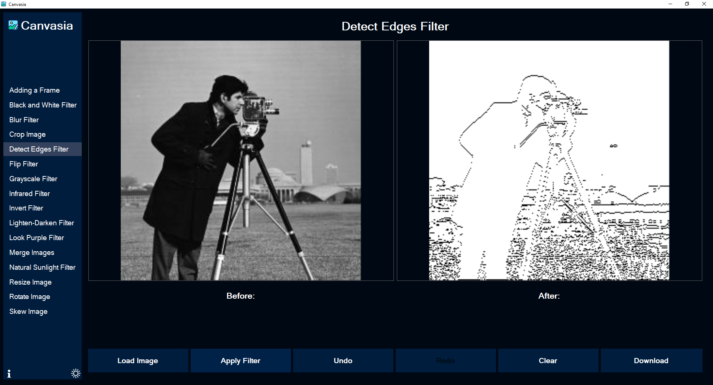

- Highlights sharp transitions between colors to reveal the structural outline of objects.

Lighten & Darken ☀️🌙

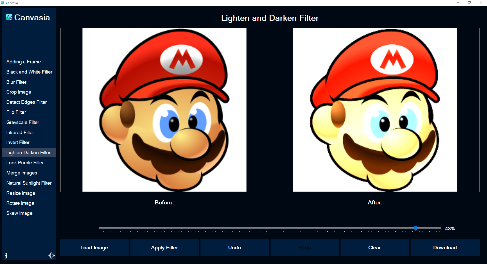

- Adjusts image exposure with separate controls for highlights, midtones, and shadows.

Add Frame 🖼️

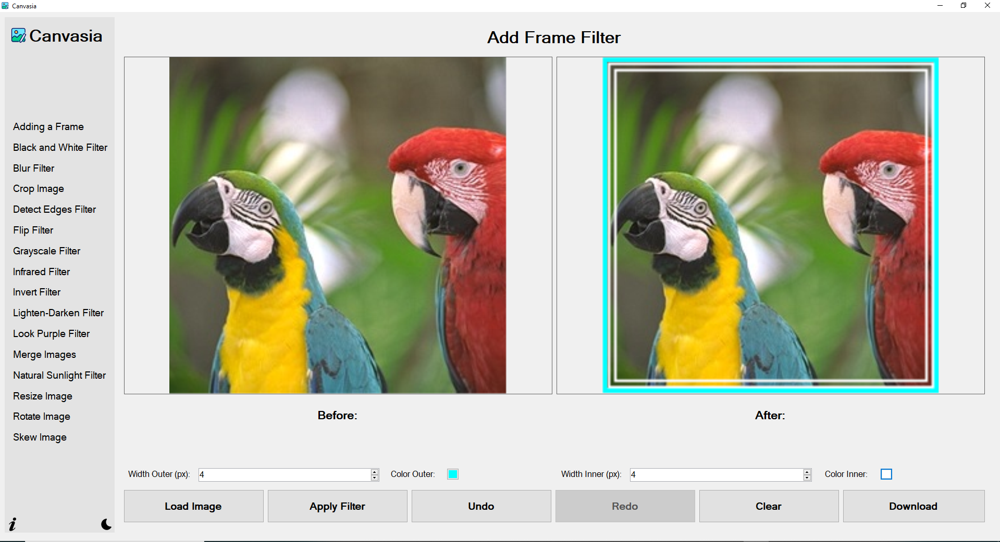

- Applies artistic borders with various styles (vintage, polaroid, modern) and customizable colors.

Black and White 🖤

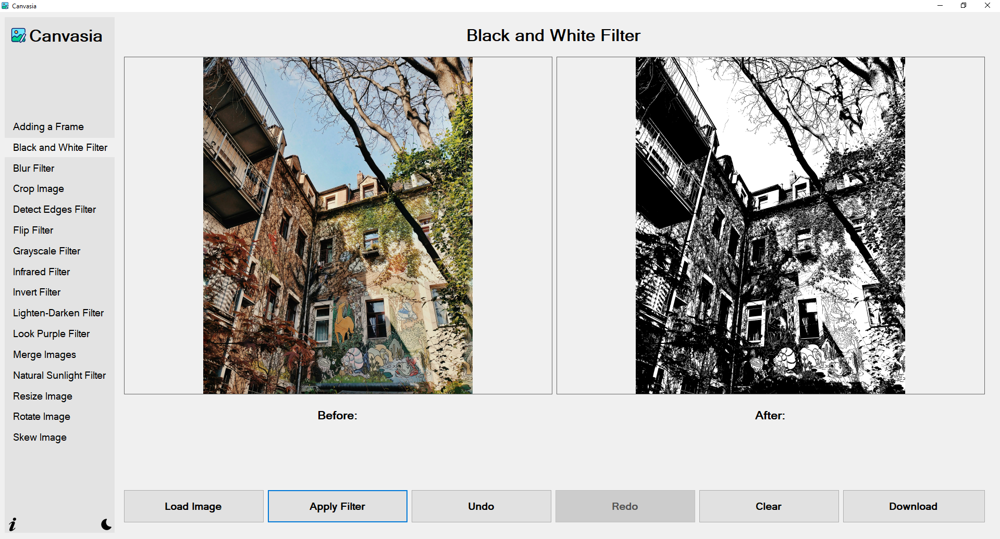

- Converts the image into pure black and white, removing all color and emphasizing contrast.

Crop ✂️

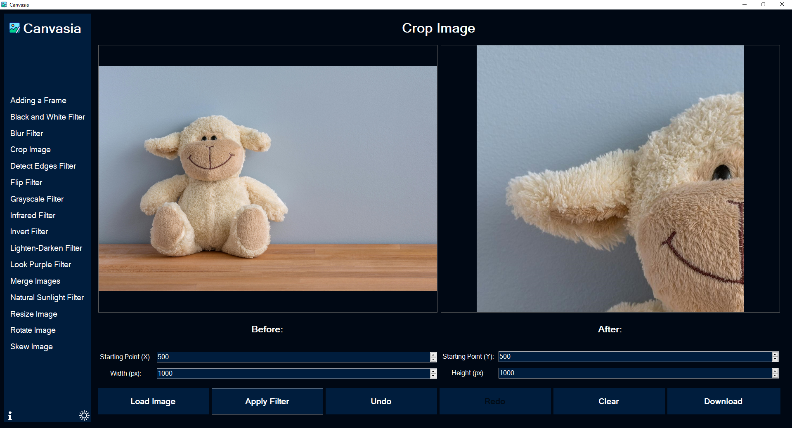

- Trims the image to a selected rectangular area, removing unwanted outer parts.

Flip 🔁

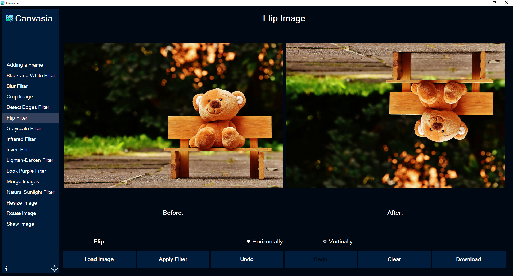

- Mirrors the image either horizontally or vertically, useful for symmetry or reversing perspective.

Grayscale 🧊

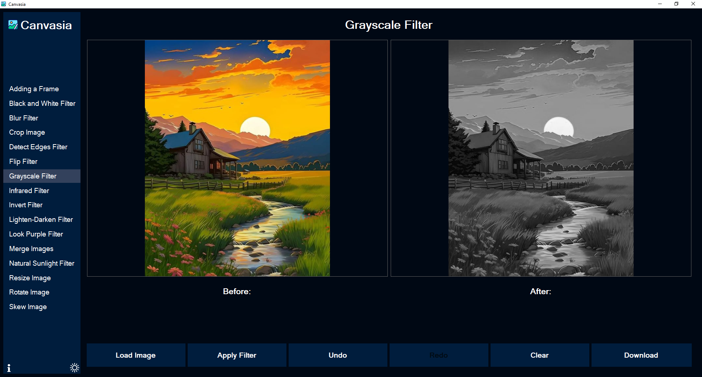

- Converts the image to shades of gray, removing all color while preserving light intensity.

Merge 🧩

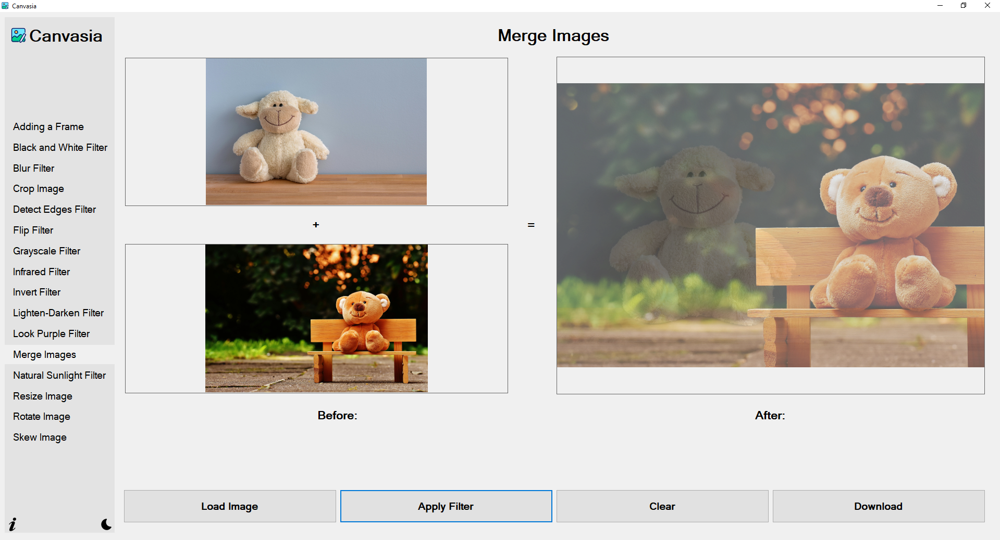

- Combines two images into a single one, placing them side-by-side or overlaying with transparency control.

Resize 📐

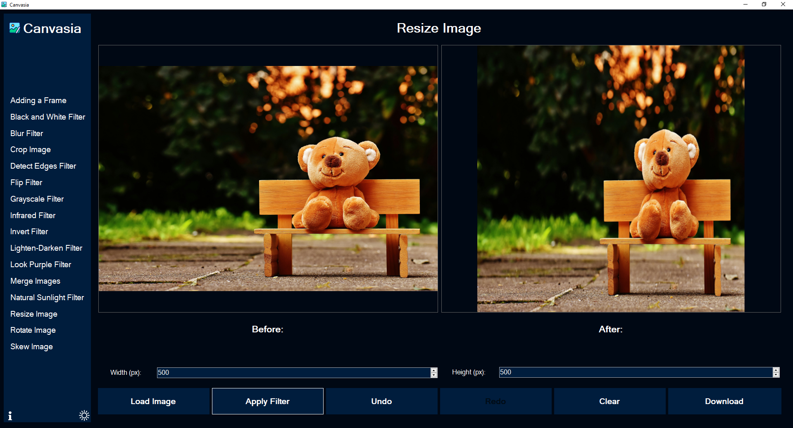

- Changes the image dimensions proportionally or freely, preserving or ignoring the aspect ratio.

Skew 🪞

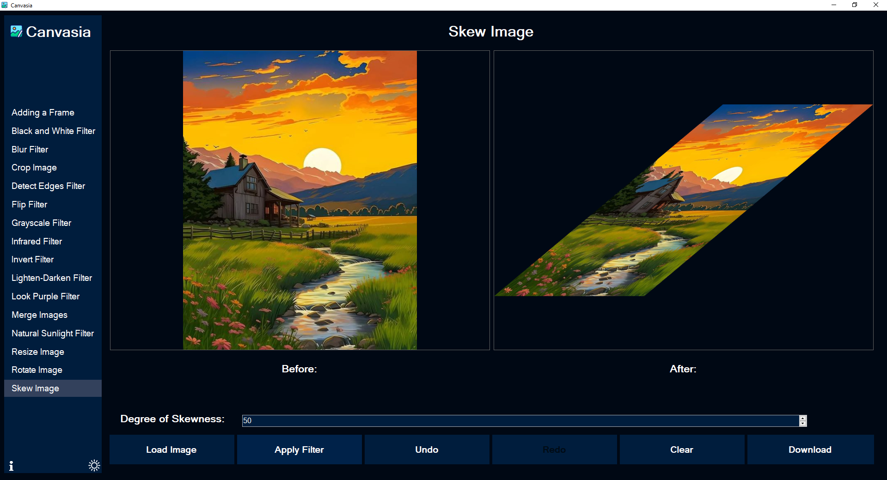

- Tilts the image diagonally by shifting pixels horizontally or vertically, creating a perspective effect.

## Features
- **Image Capture** 📸
  - Import existing images (JPG, PNG, BMP)
  
- **Additional Features**
  - Real-time filter preview
  - Save filtered images
  - Undo/Redo functionality
  - Multiple filter combinations

## Technologies Used
- C#
- .NET Framework / .NET 6+
- Windows Forms
- System.Drawing for image manipulation

## 🤝 Contributing
Contributions are welcome! Feel free to fork the repo, create a new branch, and submit a pull request.

## 📬 Contact
- Mohammed Atef Abd El-Kader: [GitHub](https://github.com/Mohammed-3tef) - [LinkedIn](https://www.linkedin.com/in/mohammed-atef-abd-elkader/)
- Esraa Emary Abd El-Salam: [GitHub](https://github.com/esraa-emary) - [LinkedIn](https://www.linkedin.com/in/esraa-emary-b372b8303/)

## 📜 License
This project is licensed under the MIT License.
